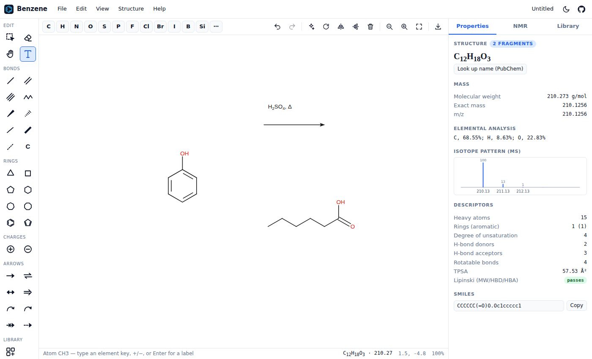
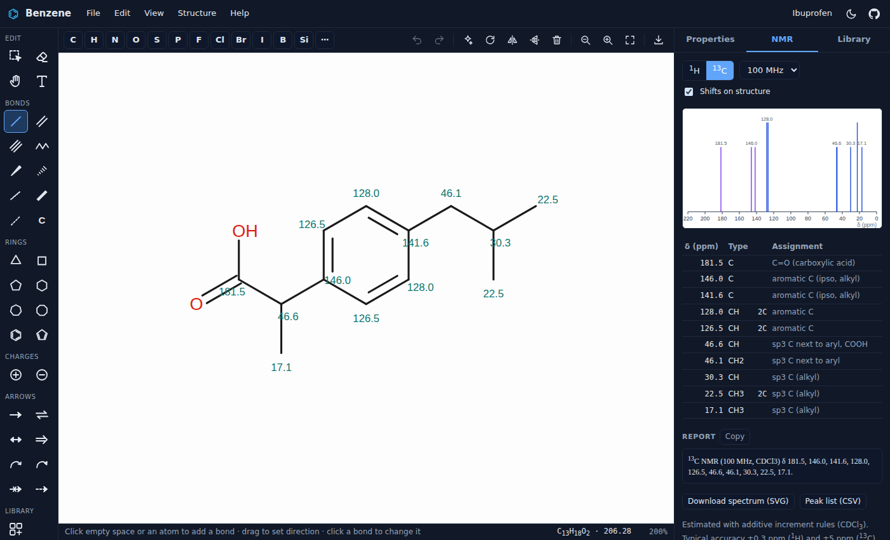

# Benzene

**A free, open-source chemical structure editor that runs entirely in your browser.**

Benzene is a ChemDraw-style drawing tool shipped as a static website: no server, no
account, no install. Host it on GitHub Pages (or any static file host) and draw,
analyse and export molecules from any modern browser. Your drawings never leave
your computer.





## Features

### Drawing
- Skeletal (line-angle) structures with automatic implicit hydrogens and atom labels (`OH`, `NH₂`, `H₃C`…)
- Bonds: single, double, triple, wedge, hashed wedge, wavy, bold and dashed. Click a bond to cycle its order or flip its stereo
- Double bonds placed automatically (inside rings, centred on C=O). Click with the double-bond tool to move one manually
- Carbon chain tool, plus ring tools (3–8 membered, benzene, cyclopentadiene) that attach to an atom (spiro) or fuse to a bond, with a live preview
- Atom tool with a full periodic table, formal charges and isotopes
- Abbreviation expansion: type `OMe`, `CO2H`, `Boc`, `OTs`, `NO2`, `Ph`… on an atom and it becomes the real group
- Reaction arrows (forward, equilibrium, resonance, retrosynthetic, no-reaction, dashed), curved mechanism arrows (electron pair and fishhook), and text annotations with sub/superscript (`H_2SO_4`, `Na^+`)
- Select, move, rotate (with a handle), flip, nudge, clean up structure, undo/redo, cut/copy/paste, duplicate, zoom and pan
- ChemDraw-like hotkeys: hover an atom and press `N`, `O`, `Cl` (`L`), `+`, `-`, `1/2/3`…
- Structure templates: common reagents, solvents, heterocycles, drugs, amino acids and nucleobases
- Valence checking, with problem atoms circled in red

### Analysis
- Molecular formula, molecular weight, exact (monoisotopic) mass and m/z
- Elemental analysis and a simulated MS isotope pattern
- Degree of unsaturation, ring and aromatic-ring counts, H-bond donors and acceptors, rotatable bonds, TPSA, and a Lipinski check
- **¹H and ¹³C NMR prediction** using additive increment rules (Shoolery, Pascual–Meier–Simon, Grant–Paul and aromatic substituent increments):
  - Grouping of equivalent atoms by symmetry, with integrations
  - First-order multiplicities and J couplings
  - A simulated spectrum at 60–800 MHz, with DEPT-style ¹³C types
  - Hover a signal to highlight its atoms, and optionally show shifts on the structure
  - Copy a journal-style report (`¹H NMR (400 MHz, CDCl₃) δ …`), or download the spectrum as SVG or the peak list as CSV
- Optional name lookups via [PubChem](https://pubchem.ncbi.nlm.nih.gov/) (structure → name and name → structure). These are the only network requests the app makes

### Storage and file formats
| Format | Import | Export |
|---|---|---|
| PNG image (with embedded editable structure) | ✅ | ✅ |
| SVG image (with embedded editable structure) | ✅ | ✅ |
| MOL / SDF (V2000; V3000 read) | ✅ | ✅ (V2000) |
| SMILES | ✅ | ✅ |
| Benzene document (`.benzene.json`) | ✅ | ✅ |

- **Library:** save drawings to a personal library in your browser (localStorage), with thumbnails, search, rename and insert. Export or import the whole library as JSON for backup
- **Autosave:** your current drawing is restored when you come back
- **Clipboard and sharing:** copy SMILES, MOL blocks or images to the clipboard; paste SMILES or MOL text straight onto the canvas; drag and drop files; share a link (`?smiles=…`)
- **Export styles:** images export at 1–8× scale, with a transparent or white background, in a screen style or ACS 1996 style

## Getting started

Benzene has **zero dependencies and no build step**: it is plain ES modules.

```bash
git clone https://github.com/dmdhrumilmistry/benzene.git
cd benzene
python3 -m http.server 8080   # or: npx serve .
# open http://localhost:8080
```

ES modules must be served over HTTP, so opening `index.html` directly from disk (`file://`) won't work.

### Deploy to GitHub Pages
1. Push the repository to GitHub.
2. Go to **Settings → Pages** and set **Source** to **GitHub Actions**.
3. Every push to `main` runs the tests and deploys the site (`.github/workflows/pages.yml`).

### Run the tests
```bash
npm test        # runs `node --test`; needs Node 20 or newer
```

## Keyboard shortcuts (summary)

| Context | Keys |
|---|---|
| Tools | `V` select · `E` eraser · `1/2/3` bonds · `W`/`Q` wedge/hash · `A` chain · `R` benzene · `3`–`8` rings · `T` text · `X` arrow · `Shift+T` templates |
| Hover atom | `C N O S P F H I`, `L` = Cl, `B` = Br · `+`/`-` charge · `1/2/3` add a bond · `Enter` type a label · `Del` |
| Hover bond | `1/2/3` order · `W`/`H` wedge/hash (press again to flip) · `Y` wavy · `0` plain · `Del` |
| General | `Ctrl+Z/Y` undo/redo · `Ctrl+C/X/V/D` · `Ctrl+A` · `Ctrl+S` save to library · `Ctrl+E` export · `Ctrl+0` fit · `Space`+drag pan · `?` help |

On macOS, use `⌘` instead of `Ctrl`.

## Project structure

```
index.html            App shell
css/style.css         UI styles (light and dark themes)
js/main.js            App wiring: menus, dialogs, keyboard, storage
js/core/              Chemistry engine (DOM-free, unit tested in Node)
  elements.js         Periodic table, masses, isotopes, valences
  molecule.js         Molecular graph model
  rings.js            SSSR ring perception and Hückel aromaticity
  smiles.js           SMILES parser/writer, kekulization
  molfile.js          MOL/SDF reader/writer
  layout.js           2D coordinate generation
  properties.js       Formula, masses, isotope pattern, descriptors
  nmr.js              1H/13C NMR prediction and spectrum simulation
js/editor/            Drawing engine
  editor.js           Tools, hit testing, history, interaction
  renderer.js         SVG depiction and export
  document.js         Document model (molecule + arrows + text)
  templates.js        Rings, abbreviations, template library
js/ui/                Panels, file I/O, storage, PubChem client
tests/                node:test unit tests
```

## Contributing

Contributions are very welcome — see [CONTRIBUTING.md](CONTRIBUTING.md). Easy places to start:

- **Templates:** add structures to `js/editor/templates.js` (they are just SMILES)
- **NMR accuracy:** improve the increment tables in `js/core/nmr.js` and add test cases
- **Abbreviations:** extend `ABBREVIATIONS` in `js/editor/templates.js`

## Limitations

- NMR predictions are empirical estimates for teaching and quick sanity checks. They are not a replacement for measured spectra or for database or quantum-chemical predictors.
- E/Z stereo in SMILES (`/`, `\`) isn't written yet, and `@`/`@@` tetrahedral stereo is read but not written.
- Bridged or cage ring systems (norbornane, adamantane) lay out legibly but not perfectly.
- There is no CDX/CDXML import yet.

## License

[MIT](LICENSE)
